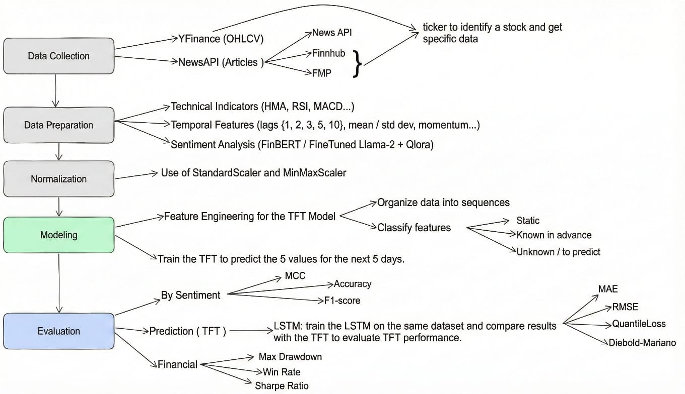

# SentiTrade-HMA

<div align="center">


**A Synergistic Framework for Algorithmic Trading via Fusion of Large Language Models and Temporal Fusion Transformers**

[](https://www.python.org/)
[](https://flask.palletsprojects.com/)
[](https://pytorch.org/)
[](LICENSE)

</div>


https://github.com/user-attachments/assets/12cf1a57-e920-4863-b2f8-67a4d9b53f96


---

## Overview

SentiTrade-HMA is a production-ready algorithmic trading system that combines **context-aware sentiment analysis** from fine-tuned Llama-2-7B with **Temporal Fusion Transformers** for multi-horizon stock price forecasting. The system achieves a **Sharpe Ratio of 5.17** and **5% MAE reduction** over price-only baselines.

### Key Features

- 🧠 **LLM-Powered Sentiment Analysis**: QLoRA fine-tuned Llama-2-7B for financial news
- 📈 **Multi-Horizon Forecasting**: Temporal Fusion Transformer with quantile predictions
- 🔍 **Model Interpretability**: Attention weights and feature importance visualization
- ⚡ **Production-Ready**: Optimized API with caching and async processing
- 📊 **Real-Time Signals**: Trading signals with confidence intervals and risk metrics

---

## 🏗️ Architecture

<div align="center">



**System Architecture: Multi-Source Data → LLM Sentiment Analysis → TFT Forecasting → Trading Signals**

</div>

---

## 🚀 Quick Start

### Prerequisites

- Conda (Miniconda or Anaconda)
- Python 3.11+
- CUDA (optional, for GPU acceleration)

### Installation

```bash
# Clone the repository
git clone https://github.com/yourusername/sentitrade-hma.git
cd sentitrade-hma/web\ app

# Create conda environment
conda create -n sentitrade python=3.11 -y
conda activate sentitrade

# Install dependencies
pip install -r requirements.txt

# Set up environment variables
cp .env.example .env
# Edit .env with your API keys (NEWS_API_KEY, FINNHUB_API_KEY, FMP_API_KEY)

# Run the application
python run.py
```

---

## 📡 API Endpoints

### Generate Trading Signals

```http
POST /api/signals/generate
Content-Type: application/json

{
  "ticker": "AAPL"
}
```

**Response:**
```json
{
  "success": true,
  "result": {
    "ticker": "AAPL",
    "aggregated_sentiment": {
      "score": 0.15,
      "confidence": 0.92,
      "sentiment": "positive"
    },
    "tft_prediction": {
      "predicted_return": 0.023,
      "confidence_interval": {
        "lower": -0.01,
        "upper": 0.05
      }
    },
    "trading_signal": {
      "signal": "BUY",
      "confidence": 0.85
    },
    "interpretability": {
      "attention_weights": [...],
      "feature_importances": {...}
    }
  }
}
```

### Cache Management

```http
GET /api/signals/cache/stats
POST /api/signals/cache/clear
```

---

## 🎨 Technologies

### Core Stack
- **Backend**: Flask 3.0, Gunicorn, Gevent
- **ML Framework**: PyTorch, PyTorch Lightning
- **Time Series**: PyTorch Forecasting (TFT)
- **NLP**: Transformers, PEFT, QLoRA

### Data & APIs
- **Financial Data**: yfinance, Finnhub, Financial Modeling Prep
- **News**: NewsAPI
- **Processing**: pandas, numpy, scikit-learn

### Visualization
- **Frontend**: Tailwind CSS, JavaScript
- **Charts**: Matplotlib (server-side)

---

## 📊 Performance Metrics

Based on Walk-Forward Validation (2018-2024):

| Metric | Value | Benchmark |
|--------|-------|-----------|
| **Sharpe Ratio** | **5.17** | >3.0 is Excellent |
| **Win Rate** | **58.3%** | Professional: 55-60% |
| **Max Drawdown** | **-3.40%** | < -10% preferred |
| **MAE Reduction** | **5%** | vs. price-only models |
| **Statistical Significance** | **p < 0.01** | Diebold-Mariano Test |

---

## 🔬 Model Interpretability

SentiTrade-HMA provides **white-box** interpretability through:

- **Variable Selection Network (VSN)**: Global and local feature importance
- **Attention Weights**: Temporal focus visualization
- **Empirical Validation**: Aggregated feature rankings across test period

**Top Features** (empirically validated):
1. Close Price (Lag 1)
2. **LLM Sentiment Score** (consistently top 3)
3. ATR (Volatility)
4. Hull Moving Average

---

## 🛠️ Development

### Project Structure

```
web app/
├── app/
│   ├── api/              # REST API endpoints
│   ├── services/         # Core business logic
│   │   ├── trading_service.py    # TFT + Signal generation
│   │   └── model_service.py      # LLM sentiment analysis
│   ├── templates/        # HTML templates
│   └── static/           # CSS, JS, images
├── models/               # Trained models
├── data/                 # TFT configuration
└── requirements.txt      # Dependencies
```

### Key Optimizations

- ✅ **Result Caching**: 5-minute TTL for instant repeated requests
- ✅ **Async Processing**: Gevent workers for concurrent I/O
- ✅ **Optimized VSN**: Only encoder VSN capture (not 1000+ tensors)
- ✅ **Production Logging**: Minimal overhead, error-focused

---

